Simple Authentication Examples - POSTMAN TEST

**Mục đích:**  
Test tất cả trường hợp bằng Postman

**SETUP:**  
1. Chạy server Basic Auth: `node basic_auth.js` (port 3000)  
2. Chạy server Cookie Auth: `node cookie_auth.js` (port 3001)  
3. Mở Postman

---

### PHẦN 1: BASIC AUTH TEST TRÊN POSTMAN

**Bước 1: Test public route 1**  
- Method: `GET`  
- URL: `http://localhost:3000/`  
- Authorization: No Auth  
- Kết quả: Welcome! Visit first public resource.  
- Status: 200  
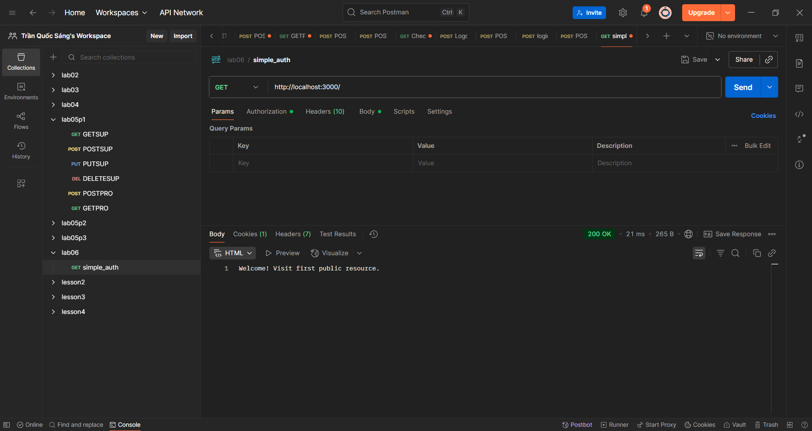

**Bước 2: Test public route 2**  
- Method: `GET`  
- URL: `http://localhost:3000/public`  
- Authorization: No Auth  
- Kết quả: Welcome! Visit second public resource.  
- Status: 200  
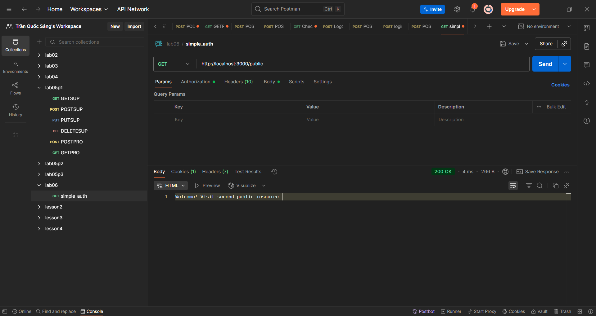

**Bước 3: Test protected route - KHÔNG CÓ AUTH**  
- Method: `GET`  
- URL: `http://localhost:3000/secure`  
- Authorization: No Auth  
- Kết quả: Authentication required.  
- Status: 401  
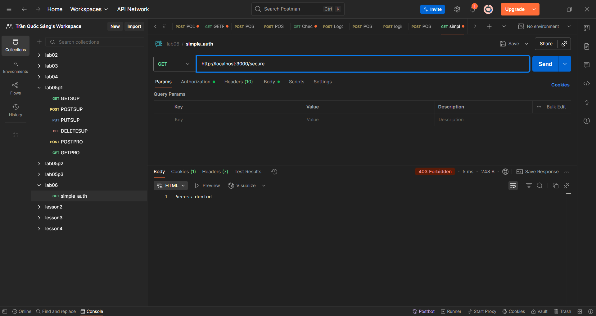

**Bước 4: Test protected route - SAI USERNAME**  
- Method: `GET`  
- URL: `http://localhost:3000/secure`  
- Authorization: Basic Auth  
- Username: `wronguser`  
- Password: `12345`  
- Kết quả: Access denied.  
- Status: 403  
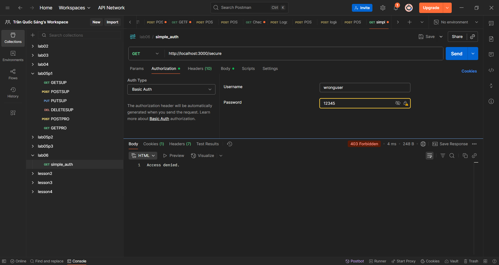

**Bước 5: Test protected route - SAI PASSWORD**  
- Method: `GET`  
- URL: `http://localhost:3000/secure`  
- Authorization: Basic Auth  
- Username: `admin`  
- Password: `wrongpass`  
- Kết quả: Access denied.  
- Status: 403  
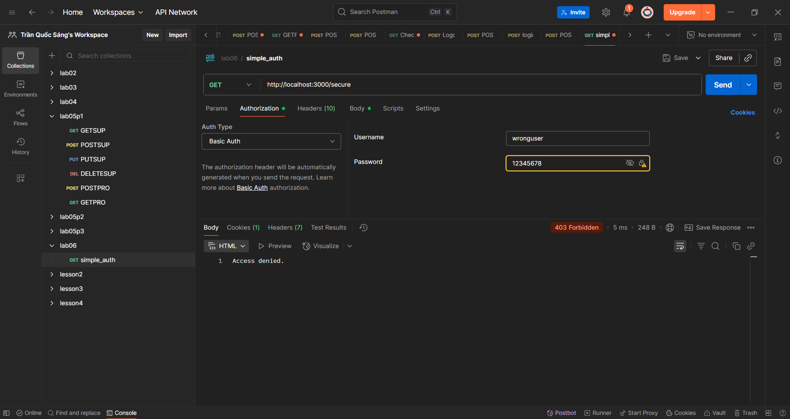

**Bước 6: Test protected route - ĐÚNG CREDENTIALS**  
- Method: `GET`  
- URL: `http://localhost:3000/secure`  
- Authorization: Basic Auth  
- Username: `admin`  
- Password: `12345`  
- Kết quả: You have accessed a protected resource  
- Status: 200  
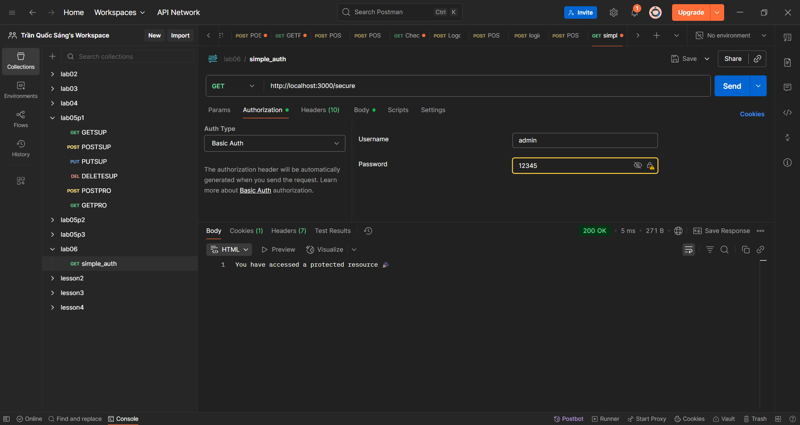

---

### PHẦN 2: COOKIE AUTH TEST TRÊN POSTMAN

**Bước 7: Test login SAI CREDENTIALS**  
- Method: `POST`  
- URL: `http://localhost:3001/login`  
- Headers: `Content-Type: application/json`  
- Body (raw JSON):  
    ```json
    {
        "username": "wrong",
        "password": "wrong"
    }
    ```
- Kết quả: Invalid credentials  
- Status: 401  
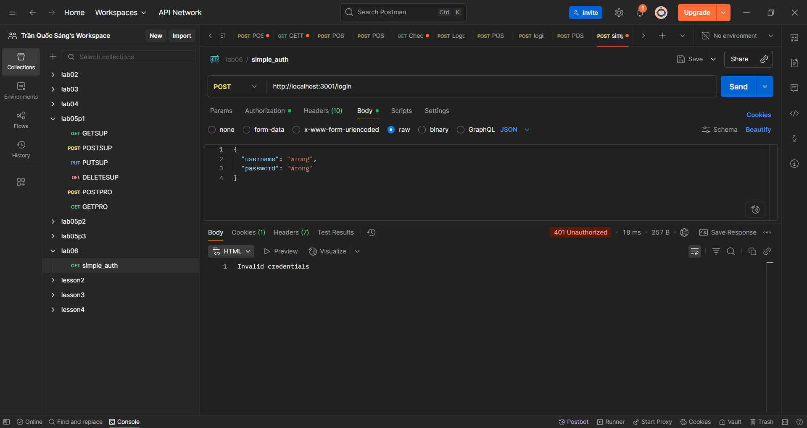

**Bước 8: Test login ĐÚNG CREDENTIALS**  
- Method: `POST`  
- URL: `http://localhost:3001/login`  
- Headers: `Content-Type: application/json`  
- Body (raw JSON):  
    ```json
    {
        "username": "admin",
        "password": "12345"
    }
    ```
- Kết quả: Logged in!  
- Status: 200  
- **Chú ý:** Postman tự động lưu cookie  
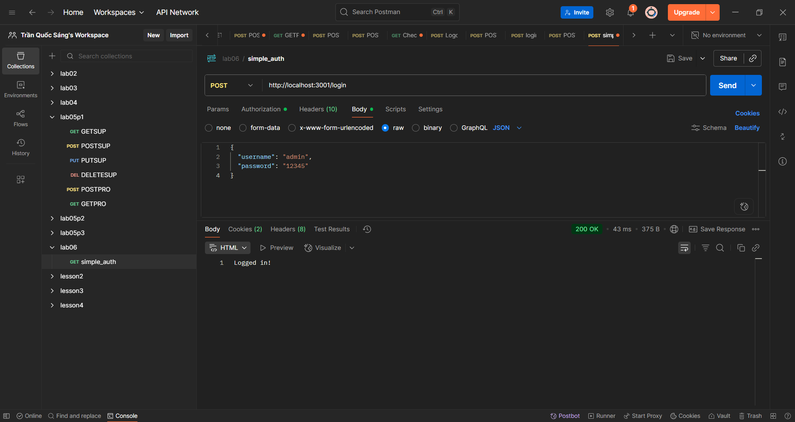

**Bước 9: Kiểm tra cookie trong Postman**  
- Vào tab Cookies (dưới URL bar)  
- Xem cookie `auth_cookie_token`  
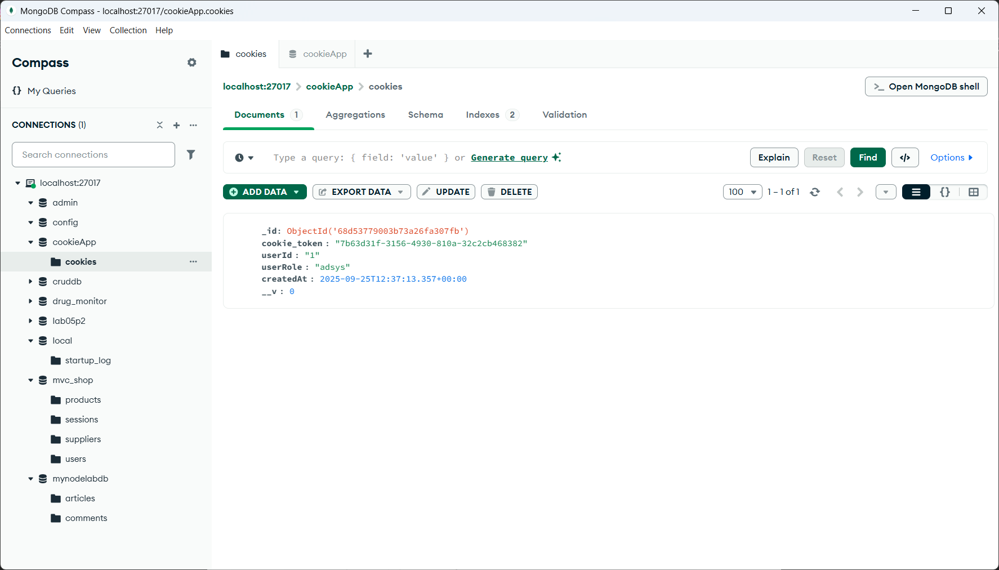

**Bước 10: Test protected route KHÔNG CÓ COOKIE**  
- Method: `GET`  
- URL: `http://localhost:3001/profile`  
- Mở tab ẩn danh (Incognito) hoặc xóa cookie  
- Kết quả: No cookie found  
- Status: 401  


**Bước 11: Test protected route CÓ COOKIE**  
- Method: `GET`  
- URL: `http://localhost:3001/profile`  
- **Chú ý:** Dùng cùng Postman window đã login  
- Kết quả: Welcome user 1, your cookie is valid.  
- Status: 200  
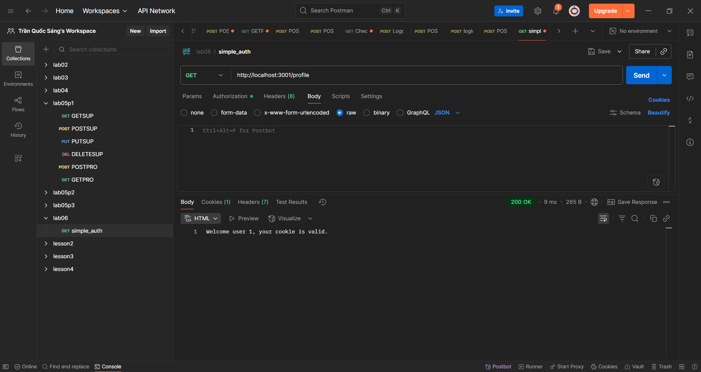

**Bước 12: Test logout**  
- Method: `POST`  
- URL: `http://localhost:3001/logout`  
- Không cần Body  
- Kết quả: Logged out.  
- Status: 200  
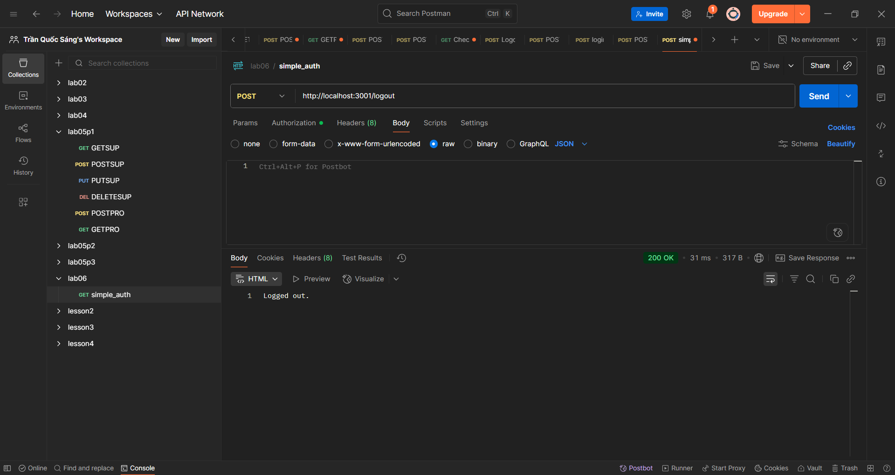

**Bước 13: Test sau logout**  
- Method: `GET`  
- URL: `http://localhost:3001/profile`  
- Kết quả: Invalid or expired cookie  
- Status: 401  

